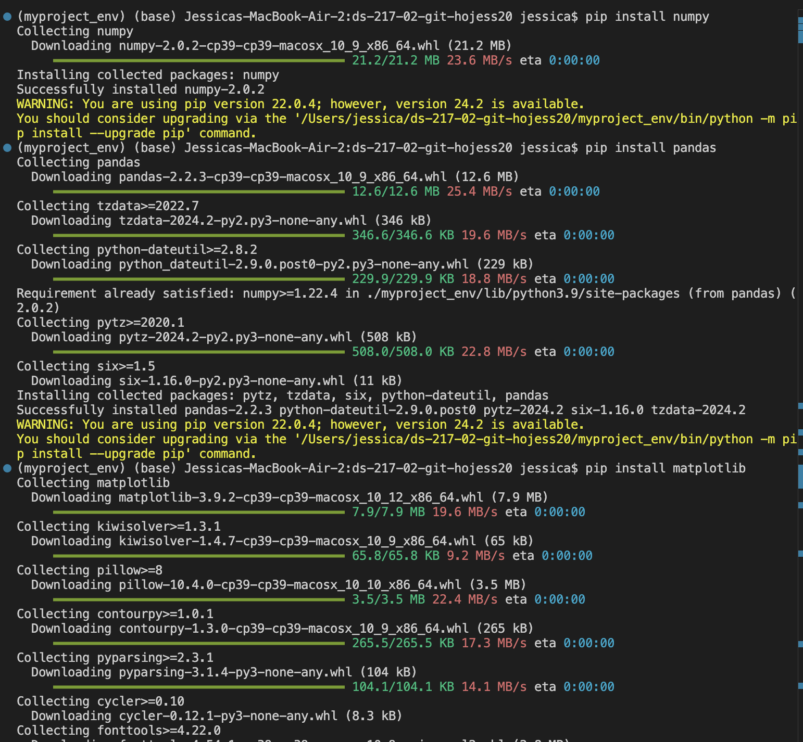

## Github username
* hojess20

## **Python solution**
### Problem
If we list all the natural numbers below 10 that are multiples of 3 or 5, we get (3, 5, 6, 9). 
The sum of these multiples is 23. Find the sum of all the multiples of 3 or 5 below 1000.

### Solution
```
sum_multiples = 0

for x in range(1000):
	if x % 3 == 0 or x % 5 == 0:
		sum_multiples += x
print(sum_multiples)
```
## **Introduction**
Hi! I'm Jessica, a 1st year student in the Health Data Science program. My goal is to become a  healthcare data scientist and work 
towards bridging data gaps to eliminate healthcare disparities. Through this course, I hope to learn how to utilize data science
techniques within Python to analyze healthcare data, identify patterns of inequity, and develop solutions that improve representation in 
clinical studies.

## Package Installation Screenshot
Here is a screenshot of the `pip` package installation:



## Meme!


